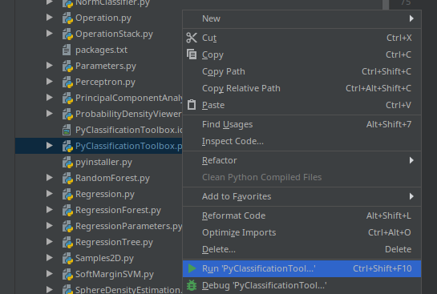
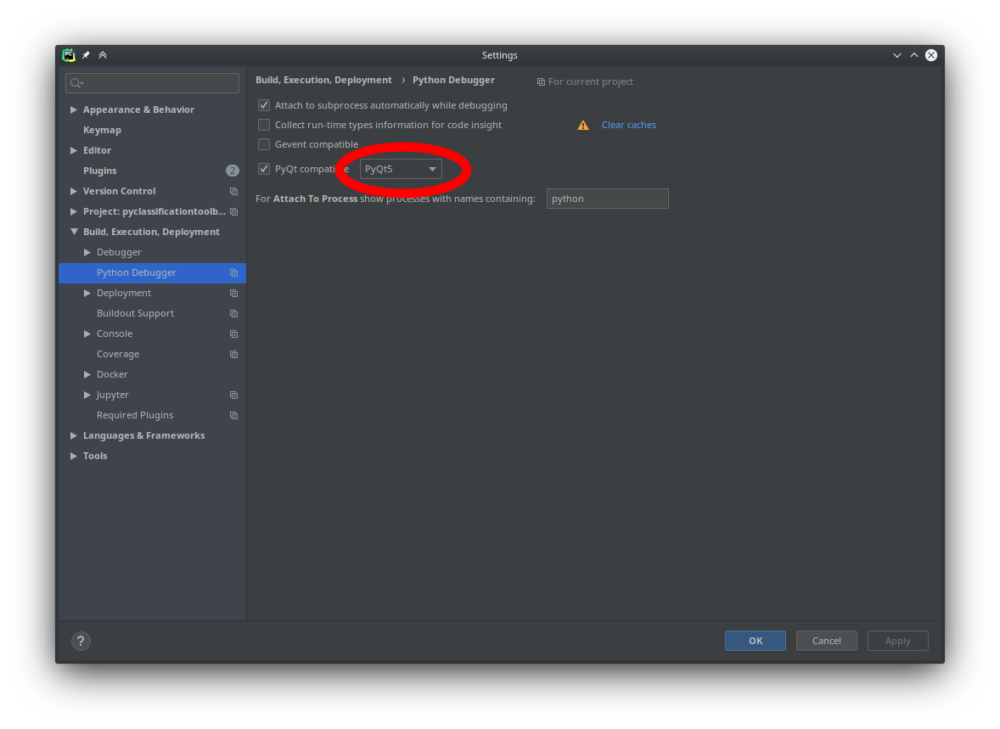

# pyclassificationtoolbox

## Installation (not necessary in CIP pool)

### Ubuntu 

```bash
pip3 install --user -r requirements.txt
```

### Anaconda on Windows/Linux

```bash
conda install pyqt numpy scipy cvxopt matplotlib scikit-learn
# This is required for the SVM exercise
conda install cvxopt
```

## Running

On Ubuntu/Debian (CIP pool)
```bash
python3 Toolbox/PyClassificationToolbox.py
```

Or when using anaconda
```bash
python Toolbox/PyClassificationToolbox.py
```

### Using Pycharm

Run one of the following lines in terminal

```bash
conda install pyqt numpy scipy cvxopt matplotlib scikit-learn
```
or 
```bash
pip install pyqt5 numpy scipy cvxopt matplotlib scikit-learn
```

Run `PyClassificationToolbox` in the `Toolbox` folder.



You can debug your programs by activating PyCharm's pyqt5 mode:



